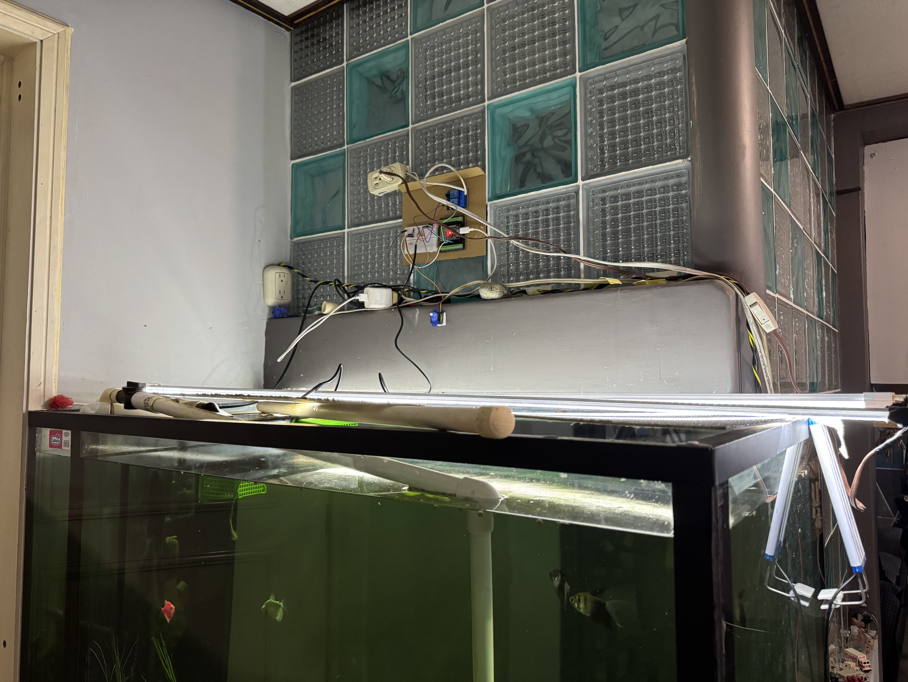
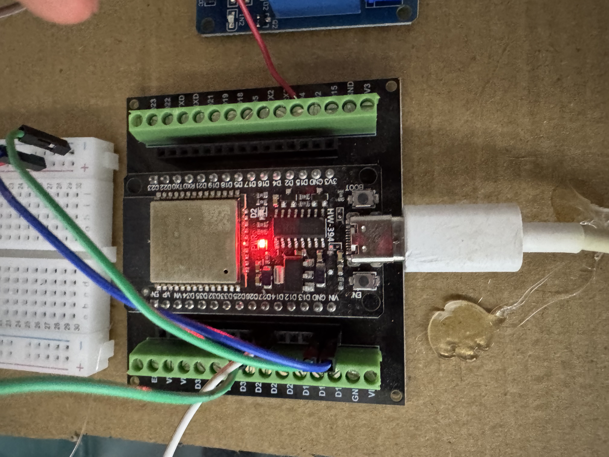
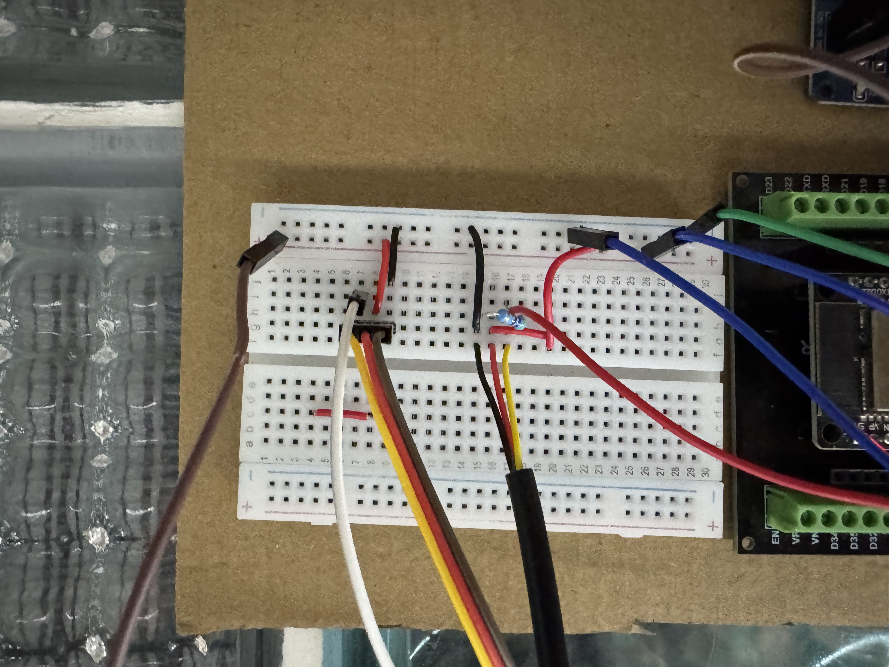
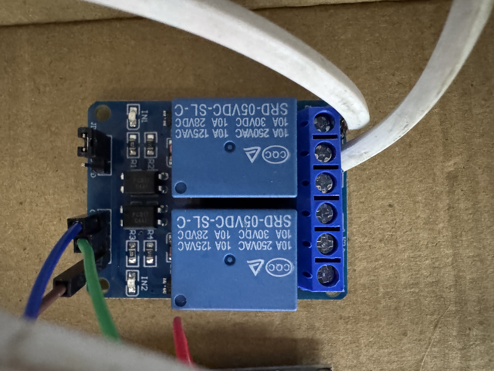
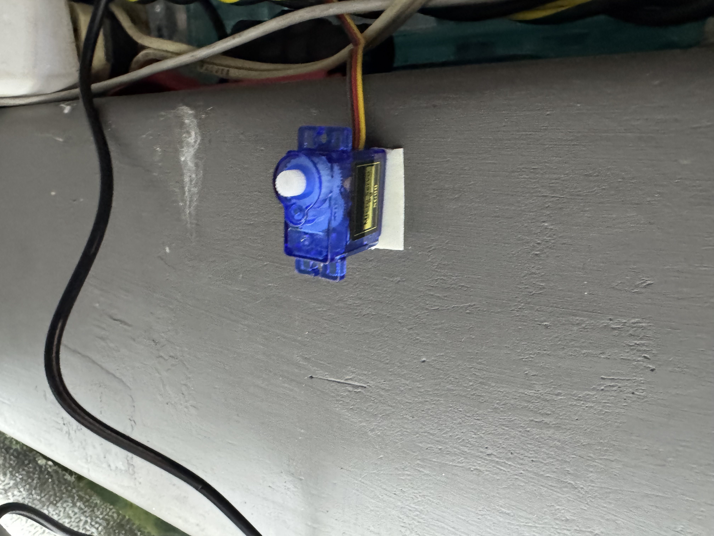
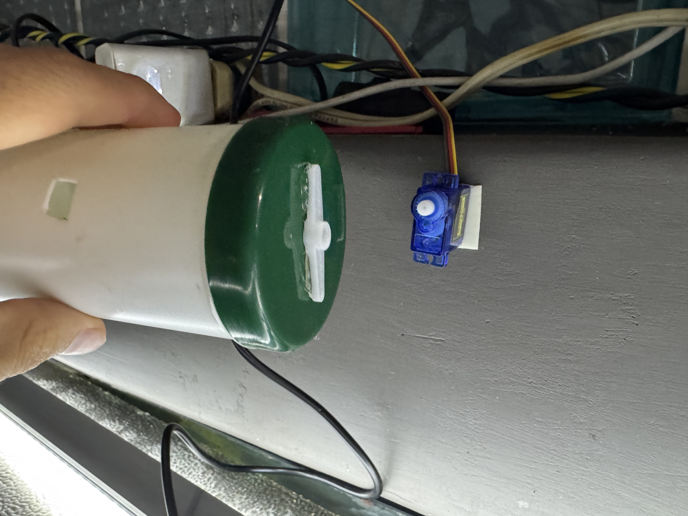
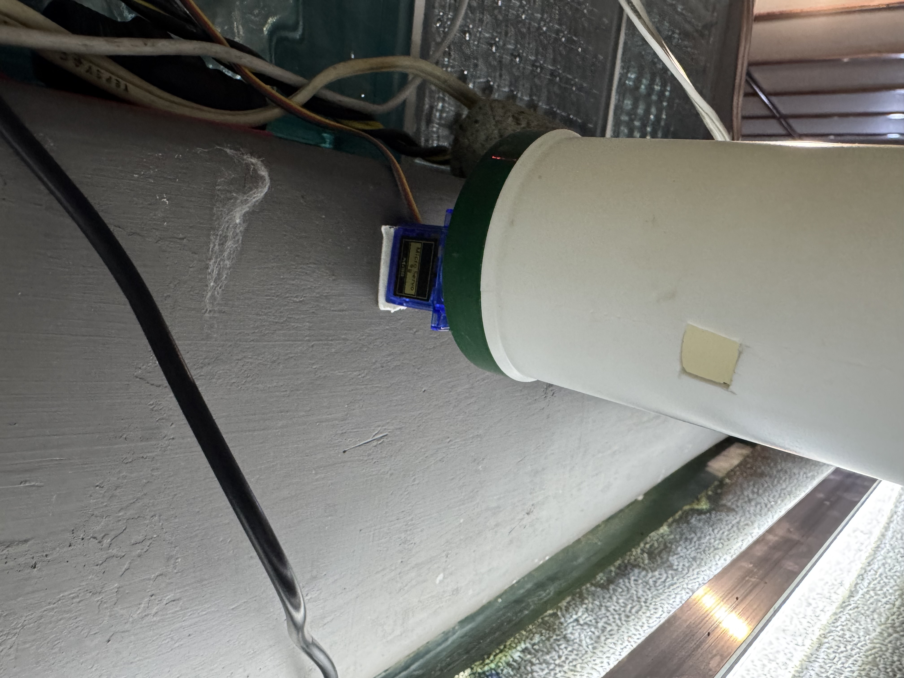

<div align="center">

# Sistema de comedero automátco para pecera
### Sistema Automatizado para el Cuidado de Peceras




*Proyecto de Internet de las Cosas (IoT) diseñado para automatizar el cuidado de una pecera. El sistema controla una bomba de agua, automatiza un dispensador de comida casero y monitorea la temperatura del agua en tiempo real mediante un panel web.*

</div>

---

## Características Principales

* 🌡️ **Monitoreo de Temperatura:** Lectura en tiempo real del agua usando una sonda sumergible DS18B20.
* 🐠 **Alimentación Automatizada:** Control de un servomotor integrado a un dispensador casero para suministrar raciones exactas de comida.
* 🌊 **Control de Filtrado:** Gestión del encendido/apagado de la bomba de agua mediante un módulo relevador.
* 🔒 **Arquitectura Local Segura:** Toda la comunicación ocurre de forma local (LAN) usando un servidor MQTT (Mosquitto) y Node-RED ejecutados en contenedores Docker sobre una Raspberry Pi 3.

---

## Arquitectura y Software

El diseño se basa en un modelo descentralizado de publicación/suscripción mediante el protocolo **MQTT**.

<div align="center">
  
  <br>
  <em>Panel de control y orquestación lógica en Node-RED</em>
</div>

1.  **Cerebro (Servidor):** Una Raspberry Pi 3 ejecuta Docker. Hospeda el broker *Eclipse Mosquitto* para la mensajería y *Node-RED* para la orquestación lógica y la interfaz de usuario.
2.  **Músculo (Cliente):** Un ESP32 conectado por Wi-Fi se encarga de interactuar físicamente con los sensores y actuadores.

---

## 🛠️ Hardware y Circuito

<div align="center">
  
  <br>
  <em>Circuito principal de control y etapa de potencia montados en la pared</em>
</div>

<br>

<table align="center">
  <tr>
    <td align="center"><br><em>Microcontrolador ESP32</em></td>
    <td align="center"><br><em>Circuito con Resistencia Pull-Up</em></td>
  </tr>
</table>

<div align="center">
  
  <br>
  <em>Etapa de potencia: Módulo Relevador controlando la bomba</em>
</div>

### Lista de Materiales (BOM)
* 1x Tarjeta de desarrollo ESP32.
* 1x Placa de expansión (Shield) para ESP32.
* 1x Protoboard de media galleta.
* 1x Raspberry Pi 3 Model B con tarjeta MicroSD.
* 1x Módulo Relevador de 5V (SRD-05VDC-SL-C).
* 1x Sonda de Temperatura Sumergible DS18B20.
* 1x Resistencia de 4.7kΩ (Pull-up).
* 1x Bomba de agua sumergible.

> **Requisito Crítico de Alimentación:**
> Debido al consumo síncrono del módulo Wi-Fi, la bobina del relevador y el servomotor (~1.5A pico), el circuito del ESP32 **debe ser alimentado por una fuente dedicada de 5V a 2A** (Mínimo). Alimentar el sistema a través del puerto USB de la PC provocará caídas de voltaje.

### Diagrama de Conexiones (Pinout ESP32)

| Componente | Pin ESP32 | Alimentación | Tierra (GND) | Notas Adicionales |
| :--- | :--- | :--- | :--- | :--- |
| **Módulo Relevador (IN1)** | `D26` | `VIN` (5V) | `GND` | Conexión a la bomba en pines COM y NO. |
| **Servomotor SG90 (Señal)** | `D27` | `VIN` (5V) | `GND` | Control de pulsos por ancho de banda. |
| **Sensor DS18B20 (Datos)** | `D4` | `3V3` (3.3V) | `GND` | Requiere resistencia de **4.7kΩ** entre `D4` y `3V3`. |

---

## Dispensador Casero de Alimento

Para resolver la dosificación sin usar impresión 3D, se diseñó un ingenioso mecanismo utilizando tubería de PVC y la tapa plástica fijada al aspa del motor.

<table align="center">
  <tr>
    <td align="center"><br><em>1. Fijación</em></td>
    <td align="center"><br><em>2. Acoplamiento</em></td>
    <td align="center"><br><em>3. Finalizado</em></td>
  </tr>
</table>

1. El Servomotor SG90 se fija a la estructura cerca del área de alimentación.
2. Se utiliza un tubo de PVC cerrado con un orificio inferior dimensionado para las raciones.
3. Se acopla mecánicamente el aspa del servo a la tapa del dispensador.
4. **Lógica de Software:** El código gira el servo 90° y regresa a 0°, destapando el orificio lateral por una fracción de segundo y permitiendo la caída por gravedad de una ración doble exacta a la pecera.

---

## Configuración y Despliegue

### 1. Servidor Docker (Raspberry Pi)
Video de funcionamiento del sistema: https://drive.google.com/drive/folders/1H6vibHPFN_1VaHEIQuGd3jOt_XLSVmgq
Clona este repositorio en tu Raspberry Pi y levanta la infraestructura de red ejecutando:
```bash
sudo docker compose up -d
